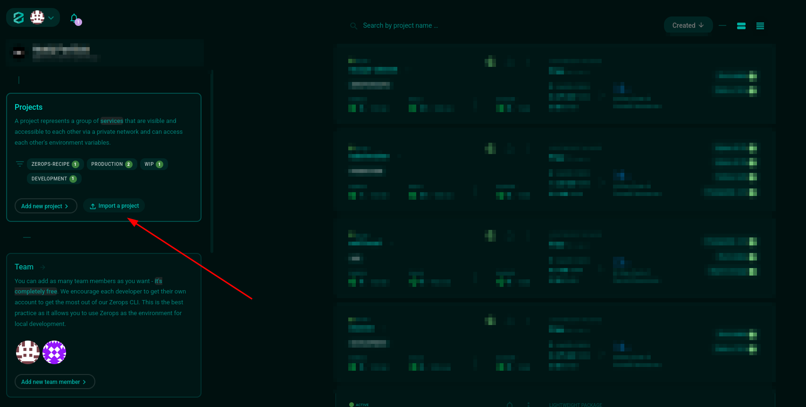
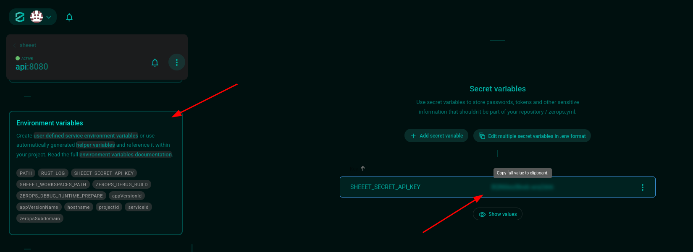
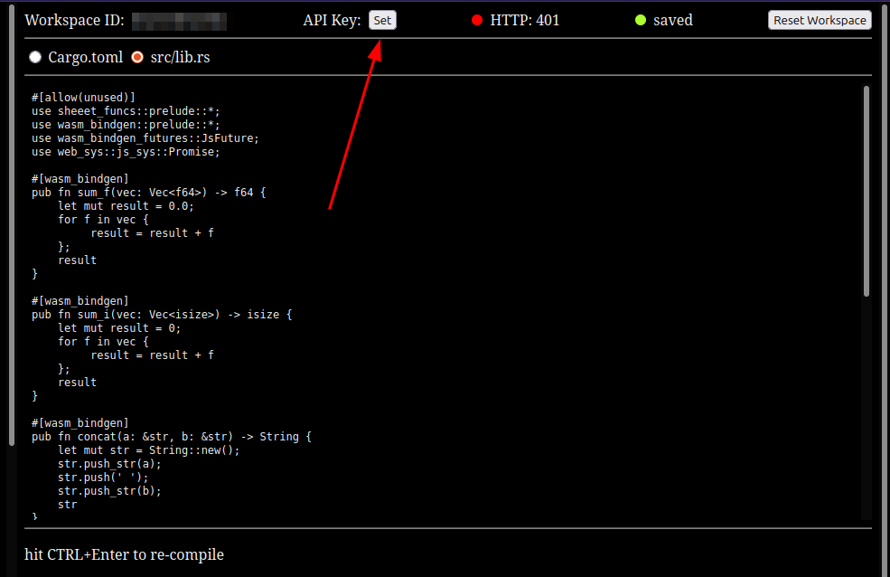

# Sheeet!

Rust and WebAssembly powered spreadsheet. **Sheeet!** is just a classic, in-browser spreadsheet, but with a twist: Users can define their own functions - in Rust - and use them to create and transform data in any way imaginable. Both _sync_ (sum range of numbers) and _async_ (fetch data over HTTP) functions are supported. 


## Public Demo

> [!WARNING]
> Don't share any sensitive information in the code to be compiled.

Live at: [https://sheeet.matejpavlicek.cz](https://sheeet.matejpavlicek.cz?demo=true)

Sheet data lives in your browser, it is not sent to the public demo backend.

## Disclaimer
This is my first project written in Rust, and it currently primarily serves as a learning opportunity.
The project is still v0. Be cautious using it in production - **you may lose your data**.

[Security/Isolation Brainstorm](assets/security-isolation-brainstorm.md)

## The Future
The current code editing in the browser is close to unusable. It would be great to sync the user's local code in the user's favorite code editor with the Sheeet! app, either via git or some form of ssh (scp).

Adding SQL interface and some database-like functionalities would also be great.

### WASM's (In)Efficiency
The initial idea of this project was: _"Let's build a spreadsheet powered by Rust. It shall be fast and efficient (because Rust) and easy to use by Rust users."_ - Well, this idea dissolved rather quickly.
The current implementation relies heavily on the JS and WASM (wasm-bindgen) interface and the interpretability of JS to resolve user-defined functions. Majority of memory allocations is done in the JS runtime.
The communication between Rust WASM and JS is definitely not for free. One could make the argument that this hybrid is slower than vanilla JS.

> TODO: Benchmarks?

WASM Rust platform has many limitations, many features (e.g. `thread::sleep()`, common HTTP client libs, ...) - that typical Rustacean is used to - are not available in `wasm32-unknown-unknown` target.

### The Potential
Having said that, there are plans for WASM to eventually be able to manage the DOM directly without the need to jump to JS.
And with some (a lot of) UI tweaks and enterprise-grade support for storing data, I believe this tool could make sense. The goal is still the same:

> Create browser enabled, fast and efficient, highly customizable spreadsheet for Rust power users.

This tool may eventually be useful for data analysts in their day job. Spreadsheet + SQL interface + Rust. What's not to like? :)

## How to Deploy?

This quick tutorial will deploy your own **private** instance of Sheeet!, that is secured against public usage via `SHEEET_SECRET_API_KEY`.
If you wish to deploy public instance, just remove the `SHEEET_SECRET_API_KEY` secret environment variable from the import yaml file.

1. Sign Up to [Zerops.io](https://app.zerops.io) (as of 2025 you'll receive free credits upon Sign Up)
2. In the GUI navigate to "Dashboard > Import a project"



And paste there the following contents of `zerops-import.yml`:
```yaml
#yamlPreprocessor=on
project: 
  name: recipe-sheeet
  tags:
    - zerops-recipe
services:
  - hostname: api
    type: rust@stable
    priority: 10
    envSecrets:
      SHEEET_SECRET_API_KEY: <@generateRandomString(<32>)>
    maxContainers: 1
    verticalAutoscaling:
      minRam: 0.25
    buildFromGit: https://github.com/tikinang/sheeet@main
    enableSubdomainAccess: true
  - hostname: app
    type: static@latest
    buildFromGit: https://github.com/tikinang/sheeet@main
    enableSubdomainAccess: true
```

3. Wait for deployment process to finish
4. Go to "Dashboard > `recipe-sheeet` > `api` > Environment Variables > Secret Variables" and copy the `SHEEET_SECRET_API_KEY` value



5. Visit deployed site via "Subdomain Access" and set your API Key



6. Enjoy!

## TODOs and Contributing

Any feedback, ideas or bug reports are warmly welcomed! Just open an issue.

### Necessary
- [x] implement spreadsheet functionality
  - copy, cut, paste cell
  - select and manipulate multiple cells
  - deselect cell out when clicking in the editor
- [x] support for range references
- [x] create public lib crate with basic functions in prelude
  - `add`, `sub`, `mul`, `div`, `pow` (match the operators below)
  - `avg`, `sum`, `med`, `concat_with`
  - `http_get` (enabled by a feature, keep the first compile nice and fast)
- [x] enhance workspace isolation
  - allow making API access private (`SHEEET_SECRET_API_KEY`)
- [x] workspace management
  - reset workspace (both ID and sheet data)
  - set secret API key
  - workspace status bar (ID, API key, compile status, save status)
- [x] prepare Zerops Recipe for simple deployment
- [x] better onboarding (default data and code with comments)
- [ ] extensive UI and error handling testing

### Nice to Have
- [ ] add operators support (`+`,`-`,`*`,`/`,`^`,`%`) in expression parsing
- [ ] add and remove columns and rows
- [ ] use `async` instead of spawning threads in `PUT /compile`
- [ ] browser stored environment secrets
- [ ] pre-heat workspaces for demo newcomers
- [ ] on-save formatting support
- [ ] code highlighting ([`highlight.js`](https://highlightjs.org))
- [ ] allow more robust crate structure
- [ ] shareable workspaces (both data and code)
- [ ] add note to `README.md` where which data lives
- [ ] extender on range end
- [ ] support Vim motions
- [ ] How does it work? section in `README.md`

### Known Errors
- [ ] self reference should error
- [x] update unbounded range dependents
- [ ] `=add(A1,,)` panics

## Development

Prerequisites:
- Rust and Cargo installed (https://doc.rust-lang.org/cargo/getting-started/installation.html)
- Trunk (WASM and JS packer) installed (`cargo install --locked trunk`)

Running locally:

- start the API, API will listen on port `:8080` by default
```shell
mkdir $HOME/workspaces
RUST_LOG=debug cargo run --package sheeet-api

# changing the workspaces artifacts path, default is $HOME/workspaces
export SHEEET_WORKSPACES_PATH=/some/other/path 
RUST_LOG=debug cargo run --package sheeet-api
``` 
- serve the GUI, GUI will be served on port `:7878`
```shell
cd ./wasm
trunk serve

# with console debug logging enabled
trunk serve --features debug-log
```
- visit http://localhost:7878
- `trunk serve` will auto-reload on changes in the `./wasm/...` code

Adding base functions to the [sheeet_funcs::prelude](https://crates.io/crates/sheeet-funcs):
- change `sheeet-funcs` dependency to local path in the user defined `Cargo.toml` (in the Sheeet! app) and hit CTRL-Enter
```toml
[dependencies]
sheeet-funcs = { path="/path/to/the/cloned/sheeet/repo/funcs", features=["fetch"] }
```
- test the functionality in the app
- write tests
- and maybe publish your own crate to use it via `cargo publish`, or wait for maintainers to publish a new version